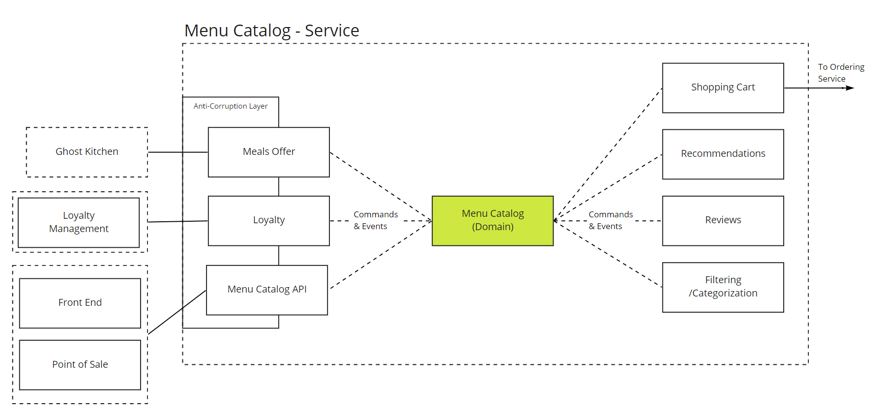
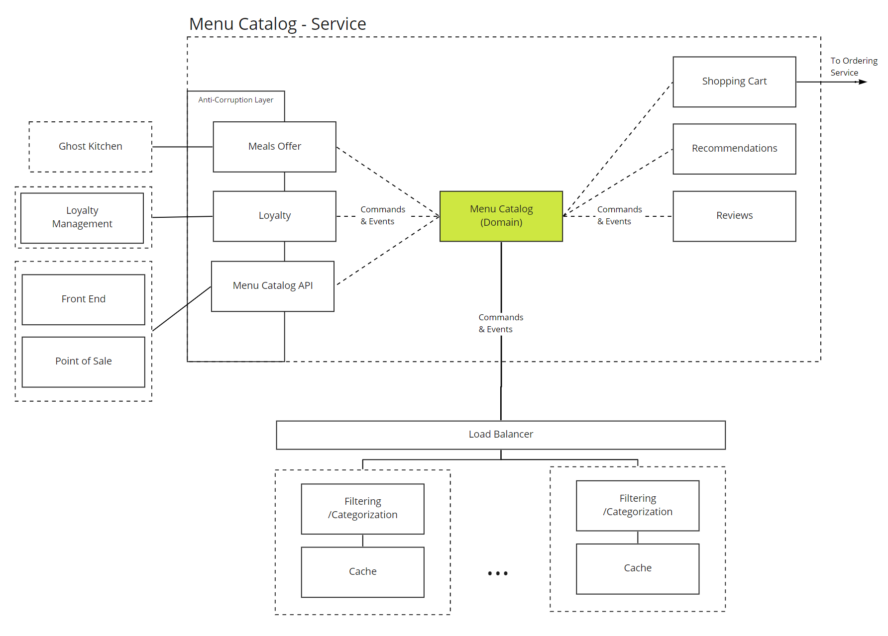

# System approach 

## Design Desicions 

### Service-oriented approach 

The main proposal is to go with a quite big services that will help to develop, test, and deploy main logical parts independently. Identified services share common Quality Attributes, so the same set of Tactics can be applied. All those activities pointed to reduce time-to-market. 

### Modularized services 

Important decision here is to isolate communication between internal modules and make it as transparent as possible, pretending that there is the network connection.  

### Event sourcing 

### Log-based communication for information propagation between services 

Communication between services might be implemented in many ways. For service oriented approach there is an anti-pattern that we'd like to avoid: spaghetti with a meat-balls. We'd like to limit direct communication between services in case of updating supporting services like reporting or messaging. In fact, we was inspired by [M.Kleppmann talk](https://martin.kleppmann.com/2015/05/27/logs-for-data-infrastructure.html) about solving complexity with log-based streams. 

The main benefit that every service can consume data on it's own pace independently. It may reflexing requirements for availability and performance for some services, that will also allows to buy cheaper deployment instances for services. 

### Health checks based on business critical path scenarious 

### Independent data storage for reporting 

## Alternatives 

Number of alternatives that were rejected for now. 

### Microservices from the start 

Microservice approach requires a lot of attention to infrastructure, separation of responsibility, preferably stable and known domain model. For the _ordering system_ it's not applicable and developers effort will be wasted for invisible for end users things. 

Microservices should grows naturally as need arise.

### Monolith 

This approach good for Prove of Concept approach and early stages of startup. Here we can see certain level of maturity, so pure monolith would be oversimplification.

## Composition of components 

## COTS 

### Event Store 

### Kafka 

### RabbitMQ 

### DataDog 

