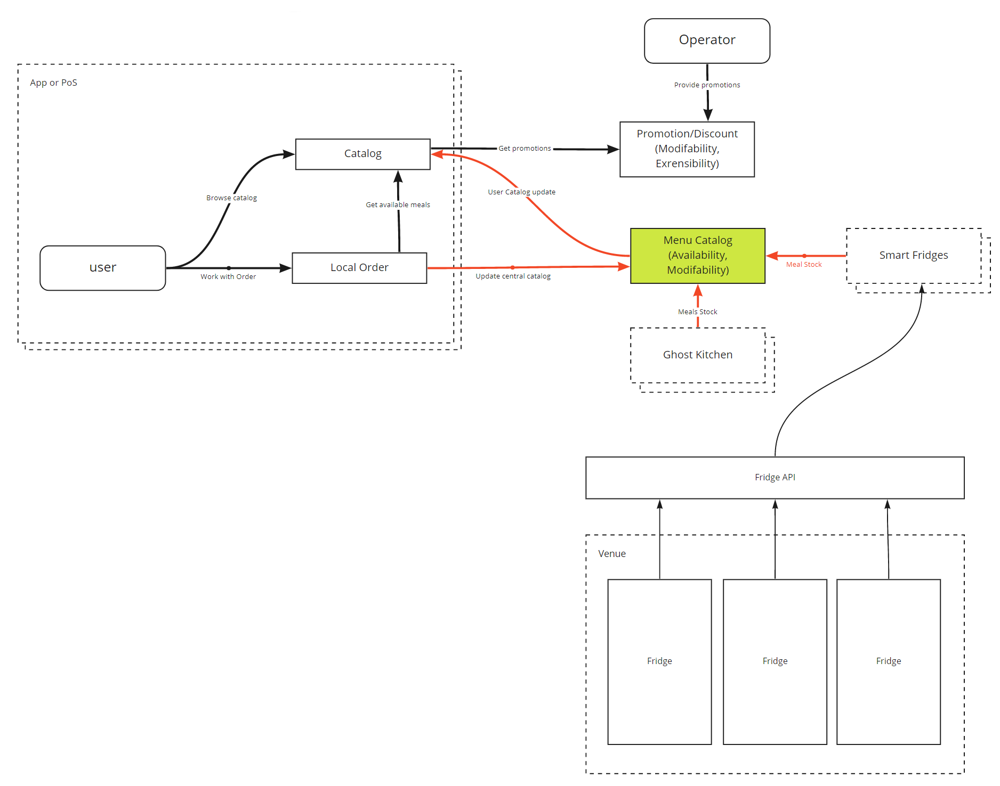
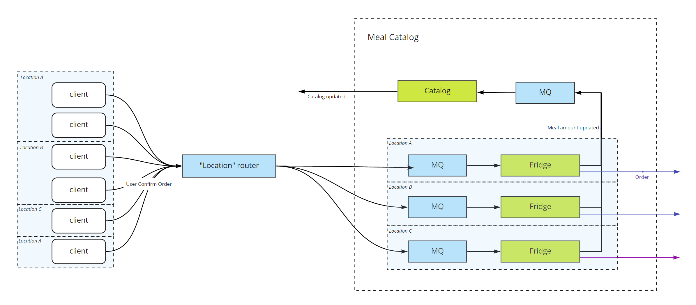
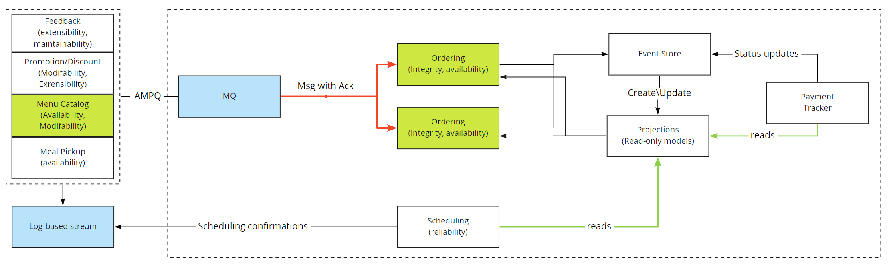

# Concurrency view

This document describes the concurrency structure of the system. It maps functional elements to concurrency units and identify the parts of the system that can execute concurrently. Docment demonstrate how system elements are coordinated and controlled.

Concurrency view is used to describe the system’s concurrency and state-related structure and constraints. This involves defining the parts of the system that can run at the same time and how this is to be controlled. Concurency view defines how the system’s functional elements are packaged into operating system processes and how the processes coordinate their execution.

## Cases

### Meal catalog integrity for available meals

The general sensitive points that we can identify here are:
- Update local catalog for users
- Update central catalog with user's data
- Update central catalog with kitchen data

**Local catalog update for users**

Updates to *central catalog* are based on users orders and should be as actual as possible. We rely on backend data consistency and integrity because, data from *Ghost Kitchen* and *Smart Fridges* can be unreliable and update frequency is unknown at the time of architecture modeling. We assume that data from *Smart Fridges* come once per *n* minute, and we don't expect streaming interfaces for keeping catalog updated.

**Central Menu Catalog update**

*Ghost Kitchen* provides updates when meals are ready for pick up -we assume this will happe once/twice per day. We get this data and update *Central Menu Catalog* by nmber of released meals.

User orders are subtracted from the available amount of tracked meals on the backend.

Additional concerns raised when we'll have several instances of menu catalog in the system, but we're going to address it by splitting menu catalog by geolocation. It will help keep catalog small and consistent within the area (city).

The main sensitive point comes from concurrent user's updates, and we should solve it. One of the solutions might be processing orders with an *actors model*. One actor per fridge helps keep the integrity of the amount of meals available in a certain fridge.

QUESTIONS:
- We don't know what data is provided from fridge(s): is it the total amount of meals or delta. We hope for a total amount.

RISKS:
- A lot of users in the area, and a need to calculate available meals in the venue. Venue can have several fridges. There should be a model how to handle this
- A huge complexity in the system if the Smart Fridge system does not sum availability of meals in a specific venue. Most probably there is no such feature and fridge(s) just share the same location -then we have to implement it on our own.

### Order processing on the back-end

One of concerns that might arise for developers that never worked before with an event sourcing system is how to handle multiple orders arriving simultaneously? Will there be a race conditions, deadlocks and other nasty things?

Based on the proposed architecture approach developers can recognize [actor pattern](https://en.wikipedia.org/wiki/Actor_model) and it means that orders processing one by one passed from one actor to another. Each actor can emitt event with additional information and keep internal state in a correct state.

For instance, subtracting meal amount from available stock happens in one actor, then a new event is created and passed to the *Ordering system*. Actor connected with a meal catalog has only one simple responsibility and can process events very fast. Taking into account the nature of the business, we could say that there will be one actor per fridge that have logical representation in our system, and a user will order meal from a specific fridge (rather from an aggregated fridge).

The ordering system among many things checks the possibility of payment charging, and does it with the help of a message queue system. When meal is purchased, a confirmed fridge actor can safely ignore the message as deduction happens, or increase the value of available meals for a particular fridge.

Events about purchase are published to a log-based streaming system. Part that is responsible for providing info about overall availability can listen for events and update internal state accordingly without race conditions and locks.

Event streaming also implies that every aggregate has a version number. This will help us avoid locks (with help of actors) in code or in storage.  

**Order processing** - sensitive point. We are concerned about processing speed as we expect to work with time limitation for order processing. Ordering module process order (could check integrity) and send events to *Payment Tracker*, that should resend data to external *Payment* processor. It looks fine for the first iteration -as we don't expect thousands of requests per minute during the first year/two. No need to update any data that is used by several services.

Having multiple readers for the order queue is safe because there are messages about events (something that already happened). The main idea behind it, is that there might be a multiple queues based on geolocation (cities or districts) that will speed up processing.  

**Scheduling** is safe as it reads data and can work on its own pace. *Ghost Kitchens* do not require real time updates as it prepares food for the one/two days upfront and needs information about refills only.

### Promotional campaigns  

We don't expect any issues with promotions, as it's one way updates from the central part and users don't have any influence on this. We don't expect promotions based on the overall amount of sold menu items.

From the operator's perspective we don't want to make it complicated right now involving CRDT (Conflict-free Replicated Data Types) as campaigns do not often change and there won't be dozens of operators. Preparing campaigns in Google Spreadsheet or Office 365 Excel do the trick. We're going to consume only final result without providing tools for creating and modifying within designed system.

### Other subsystems

Other parts of the system should consume data from log-based streaming, and they'll get all messages in some order and can process them without locks. Those systems might require internal load balancers/routers if the number of messages is huge. But still it's easy to implement as messages should contain all necessary information for processing.

## Checklist for further work

- Is there a clear system-level concurrency model?
- Are your models at the right level of abstraction? Have you focused on the architecturally significant aspects?
- Can you simplify your concurrency design?
- Do all interested parties understand the overall concurrency strategy?
- Have you mapped all functional elements to a process (and thread if necessary)?
- Do you have a state model for at least one functional element in each process and thread? If not, are you sure the processes and threads will interact safely?
- Have you defined a suitable set of inter-process communication mechanisms to support the inter-element interactions defined in the Functional view?
- Are all shared resources protected from corruption?
- Have you minimized the inter-task communication and synchronization required?
- Do you have any resource hot spots in your system? If so, have you estimated the likely throughput, and is it high enough? Do you know how you would reduce contention at these points if forced to later?
- Can the system possibly deadlock? If so, do you have a strategy for recognizing and dealing with this when it occurs?
