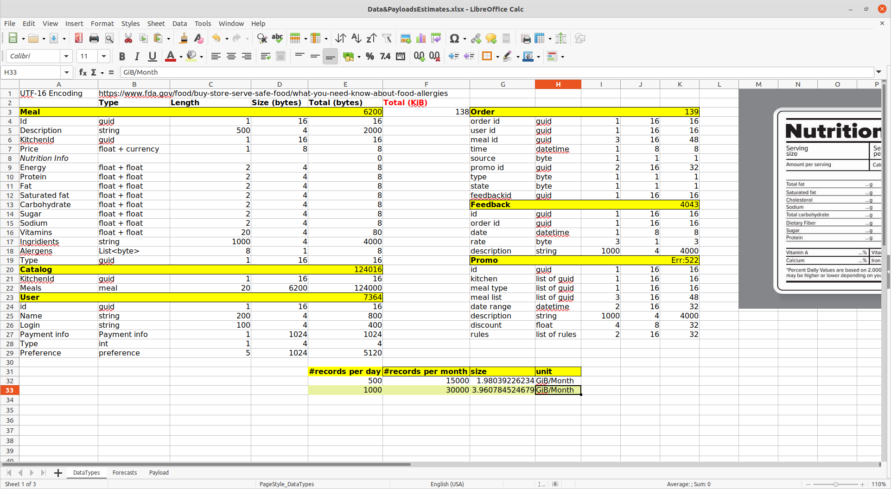
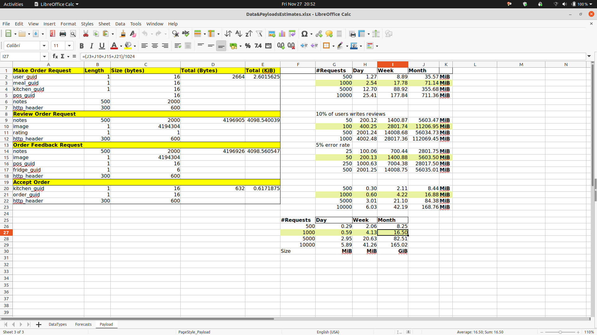
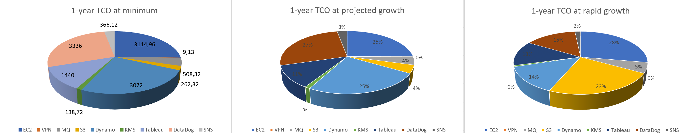

# Cost analysis considerations

[Document](https://github.com/ldynia/archcolider/blob/master/3.ViewsAndPerspectives/docs/Data&PayloadsEstimates.xlsx?raw=true)

## Introduction
While selecting infrastructure and third party systems, we were governed preliminary by costs of the solution and limited budget of the client. In rare cases we decided to pick more expensive solutions the reason for that was convenience of chosen service to exceed its monetary value.

## Caveat Emptor
Provided costs are estimated base on the list of assumption mentioned below and projection of user growth and traffic they might generate.
Assumptions:
- We estimate that Farmacy Food will reach 10K users

## Projections
### Database size
Below image illustrates few tables/documents that might be used in the solution -it's of course simplified model. Nevertheless, we can see that generating **30K** record per month (1000 records per day) will take around **3.96 GiB** of storage space. 

It's important to mention that this number is on the higher end of estimation because it assumes that the traffic to the application is distributed uniformly. In reality proposed number could be even 60% smaller than estimated **3.96 GiB**.

### Data transferr size (traffic)
Traffic forecast was calculated base on the most frequent requests to the application API. Because, Farmacy Food users will have the ability to write feedback and reviews we will provide them the ability to uploading images. We assume that image size will take 4 MiB. Furthermore, we expect that monthly only 10% of the users writes reviews and 5% of users have some problems that leads to sending a feedback. As we can see that for **1000** requests per day (30K per month) we'll end up transferring to our application around **16.5 GiB** of data, and storing around **16 GiB** of images per month. 

This estimates base on the assumption that traffic is uniformly distributes. Moreover, we don't use compression for HTTP requests and messaging request as well for images. While implementing the solution we would use appropriate compression algorithm such GZIP which is very efficient for text compression and good for image compression, therefore we could significantly lower the costs.

## Infrastructure

That chosen AWS region is us-east due to the location being the closest to Detroit which is currently the largest market.

This part only shows infrastructure elements that have costs attached.

| (Cloud or SaaS) service | Provider  |Description |
| ------------- | --------  |------------- |
| EC2           | AWS       |Instance of a   |
| Amazon MQ     | AWS       | Managed service the can provide Rabbit MQ [ADR 003](../4.ADRs/003%20Tracing%20and%20Monitoring%20Sytem.md)  |
| Application Load Balancer | AWS  | Load balancer for services running inside AWS. |
| Amazon Cognito | AWS  | Authentication and Authorization provider. |
| DataDog | DataDog | Metric and Event aggregator |
| SNS     | AWS | Notification Service used for push notifications |
| Cognito | AWS |  |
| Route 53 | AWS | Certificates (TLS) and DNS routing. |
| S3 Buckets| AWS | Storage services |
| API Gateway | AWS | Incoming requests |
| Amazon DynamoDB| AWS | NoSQL database |
| CloudFormation| AWS | Infrastructure as code solution |

## Cost

In the next few paragraphs you will find a detailed list of projected costs per service/data transfer. For a summary of costs without all the details go [here](#summary)

## Data transfer costs.
> **Important:** 
> Always prefer internal data transfer using **private** IP adresses. Using public or elastic IP addresses will incur additional costs.
> Prefer data transfers within a single _AWS Availability Zone_. Data transfers accross _AZs_ will incur additional costs.
> At the time of writing the extra costs are $0.01 per gigabyte transferred.

## Estimated cost bandwith

### Estimation basis

- All prices are in $, USD
- Prices are totalled per month in the detail paragraphs. The summary shows an overview of the costs per year.
- 1-year TCO at minimum is based on 500 customer requests per day. (15k per month) We will sometimes call this scenario MIN.
- 1-year TCO at projected growth is based on 1000 customer requests per day. (31k per month) We will sometimes call this scenario PROJECTED.
- 1-year TCO at rapid growth is based on 10,000 customer requests per day. (310k per month). We will sometimes call this scenario RAPID.

### EC2 

#### Scenarios MIN and PROJECTED
Both scenarios require the same amount of EC2 instances and attached storage.

8 instances x 0.0376 USD x 730 hours in month = 219.58 USD (monthly onDemand cost)
50 GB x 0.10 USD x 8 instances = 40.00 USD (EBS Storage Cost)

**_Total: 259.58 USD_**

#### Scenarios RAPID
16 instances x 0.0376 USD x 730 hours in month = 439.17 USD (monthly onDemand cost)
Amazon EC2 On-Demand instances (monthly): 439.17 USD

50 GB x 0.10 USD x 16 instances = 80.00 USD (EBS Storage Cost)
Amazon Elastic Block Storage (EBS) pricing (monthly): 80.00 USD

**_Total: 519.17 USD_**

### VPN
This is a fixed cost for all 3 of the scenarios.

1 connnections x 0.05 USD x 182.50 hours per month = 9.13 USD (Site to Site VPN usage cost)

**_Total: 9.13 USD_**

### Amazon MQ
#### Scenario MIN
1 brokers x 730 hours in a month x 0.05408 USD = 39.48 USD (Amazon MQ Broker cost)
1 brokers x 9 GB x 0.30 USD = 2.70 USD (Amazon MQ Broker Storage cost)
39.48 USD + 2.70 USD = 42.18 USD
Amazon MQ cost (monthly): 42.18 USD

Additional traffic costs
Intra region:
(9 GB x 0.01 USD per GB outbound) + (9 GB x 0.01 USD per GB inbound) = 0.18 USD
Data Transfer cost (monthly): 0.18 USD

**_Total: 42.36 USD_**

#### Scenario PROJECTED
1 brokers x 730 hours in a month x 0.05408 USD = 39.48 USD (Amazon MQ Broker cost)
1 brokers x 19 GB x 0.30 USD = 5.70 USD (Amazon MQ Broker Storage cost)
39.48 USD + 5.70 USD = 45.18 USD
Amazon MQ cost (monthly): 45.18 USD

Additional traffic costs
Intra region:
(19 GB x 0.01 USD per GB outbound) + (19 GB x 0.01 USD per GB inbound) = 0.38 USD
Data Transfer cost (monthly): 0.38 USD

**_Total: 45.56 USD_**

#### Scenario RAPID
1 brokers x 730 hours in a month x 0.05408 USD = 39.48 USD (Amazon MQ Broker cost)
1 brokers x 190 GB x 0.30 USD = 57.00 USD (Amazon MQ Broker Storage cost)
39.48 USD + 57.00 USD = 96.48 USD
Amazon MQ cost (monthly): 96.48 USD

Additional traffic costs
Intra region:
(190 GB x 0.01 USD per GB outbound) + (190 GB x 0.01 USD per GB inbound) = 3.80 USD
Data Transfer cost (monthly): 3.80 USD

**_Total: 100.28 USD_**

### S3 
#### MIN 
Tiered price for: 54 GB
54 GB x 0.0230000000 USD = 1.24 USD
Total tier cost = 1.2420 USD (S3 Standard storage cost)
50 PUT requests for S3 Storage x 0.000005 USD per request = 0.0003 USD (S3 Standard PUT requests cost)
50 GET requests in a month x 0.0000004 USD per request = 0.00 USD (S3 Standard GET requests cost)
10,000 GB x 0.0007 USD = 7.00 USD (S3 select returned cost)
100,000 GB x 0.002 USD = 200.00 USD (S3 select scanned cost)
1.242 USD + 0.0003 USD + 7.00 USD + 200.00 USD = 208.24 USD (Total S3 Standard Storage, data requests, S3 select cost)
S3 Standard cost (monthly): 208.24 USD

**_Total: 208.24 USD_**

#### Scenario PROJECTED
Tiered price for: 108 GB
108 GB x 0.0230000000 USD = 2.48 USD
Total tier cost = 2.4840 USD (S3 Standard storage cost)
50 PUT requests for S3 Storage x 0.000005 USD per request = 0.0003 USD (S3 Standard PUT requests cost)
50 GET requests in a month x 0.0000004 USD per request = 0.00 USD (S3 Standard GET requests cost)
10,000 GB x 0.0007 USD = 7.00 USD (S3 select returned cost)
100,000 GB x 0.002 USD = 200.00 USD (S3 select scanned cost)
2.484 USD + 0.0003 USD + 7.00 USD + 200.00 USD = 209.48 USD (Total S3 Standard Storage, data requests, S3 select cost)
S3 Standard cost (monthly): 209.48 USD

**_Total: 209.48 USD_**

#### Scenario RAPID
Tiered price for: 540 GB
540 GB x 0.0230000000 USD = 12.42 USD
Total tier cost = 12.4200 USD (S3 Standard storage cost)
50 PUT requests for S3 Storage x 0.000005 USD per request = 0.0003 USD (S3 Standard PUT requests cost)
50 GET requests in a month x 0.0000004 USD per request = 0.00 USD (S3 Standard GET requests cost)
10,000 GB x 0.0007 USD = 7.00 USD (S3 select returned cost)
100,000 GB x 0.002 USD = 200.00 USD (S3 select scanned cost)
12.42 USD + 0.0003 USD + 7.00 USD + 200.00 USD = 219.42 USD (Total S3 Standard Storage, data requests, S3 select cost)
S3 Standard cost (monthly): 219.42 USD

**_Total: 218.42 USD_**

### DynamoDB
The scenarios do not impact the cost of DynamoDB as growth after 12 months will be the main driver of costs for this service.

Data storage size: 1 TB x 1024 GB in a TB = 1024 GB
Pricing calculations
1,024 GB x 0.25 USD = 256.00 USD (Data storage cost)
DynamoDB data storage cost (monthly): 256.00 USD

**_Total: 256.00 USD_**

#### Kafka Managed Stream
> There is a markup on Outbound data for log streaming. At this point any estimate of this is unclear. We would need to calculate this after a 1 month operational run.
> Below you will find a very rough approximation:

Number of records: 1000 per minute / (60 seconds in a minute) = 16.67 per second
Pricing calculations
3 KB / 1024 KB to MB conversion factor = 0.00292969 MB (Record size)
0.00292969 MB x 16.67 records per sec = 0.05 MB/sec (Data ingress rate)
0.05 MB/sec (Data ingress rate) / 1 MB per second per shard ingress capacity = 0.05 shards needed for ingress
0.05 MB/sec (Data ingress rate) x 3 consumer applications = 0.15 MB/sec (Data egress rate)
0.15 MB/sec / 2 MB per second per shard egress capacity = 0.07 shards needed for egress
16.67 records per sec / 1000 factor for records per shard = 0.017 shards needed for records
Max (0.05 shards needed for ingress, 0.07 shards needed for egress, 0.017 shards needed for records) = 0.07 Number of shards
RoundUp (0.070) = 1 shards
1 shards x 730 hours in a month = 730.00 Shard hours per month
730.00 Shard hours per month x 0.015 USD = 10.95 USD
Shard hours per month cost: 10.95 USD
3 KB / 25 Payload Unit factor = 0.12 PUT Payload Units fraction
RoundUp (0.12) = 1 PUT Payload Units
1 PUT Payload Units x 16.67 records per sec x 2628000 seconds in a month = 43,808,760.00 PUT Payload Units per month
43,808,760.00 PUT Payload Units x 0.000000014 USD = 0.61 USD
PUT Payload Units per month cost: 0.61 USD
Extended data retention cost: 0 USD
Enhanced fan-out consumer-shard hours cost: 0 USD
16.67 records per sec x 2628000 seconds in a month = 43,808,760.00 Number of records per month
0.00292969 MB / 1024 MB to GB conversion factor = 0.00000286 GB (Record size)
Enhanced fan-out data retrievals cost: 0 USD
10.95 USD + 0.61 USD = 11.56 USD
Kinesis data stream cost (monthly): 11.56 USD

**_Total: 11.56 USD_**

### Tableau
Tableau reporting will incur the same costs in all scenarios.

Team
1 Creator + 5 Explorers

$278 USD
Bundle/Month
Billed annually ($3,340+tax)

**_Total: 278.00 USD_**

### DataDog

#### Scenario MIN and PROJECTED
[DataDog](https://www.datadoghq.com/pricing/) $15 USD per host, per month.
15 USD per host,per month *8 instances

**_Total: 120.00 USD_**

#### Scenario RAPID
[DataDog](https://www.datadoghq.com/pricing/) $15 USD per host, per month.
15 USD per host,per month *16 instances

**_Total: 240.00 USD_**

### Simple Notification Service (SNS)
> The smallest step up or down for SNS cost estimation is a 1,000,000 multiplier. The lowest level (1M) overshoots our needs for all scenarios

1 requests x 0.0000005 USD x 1000000 multiplier for million = 0.50 USD (SNS requests cost)
1 notifications x 0.0000006 USD x 1000000 multiplier for million = 0.60 USD (HTTP/HTTPS Notifications cost)
1 notifications x 0.00002 USD x 1000000 multiplier for million = 20.00 USD (EMAIL/EMAIL-JSON Notifications cost)
1 notifications x 0.00 USD x 1000000 multiplier for million = 0.00 USD (SQS Notifications cost)
0.50 USD + 0.60 USD + 20.00 USD = 21.10 USD
SNS Requests and Notifications cost (monthly): 21.10 USD

1 notifications x 0.0000005 USD x 1000000 multiplier for million = 0.50 USD (Mobile Push Notifications cost)
Mobile Push Notifications cost (monthly): 0.50 USD

SNS Requests and Notifications cost (monthly)
21.10 USD
Mobile Push Notifications cost (monthly)
0.50 USD
Data Transfer cost (monthly)
8.91 USD
Total monthly cost:
30.51 USD

**_Total: 30.51 USD_**

## Summary of costs per year

|Service                    | 1-year TCO at minimum    | 1-year TCO at projected growth     | 1-year TCO at rapid growth     |
| -----                     | ---------------------    | ------------------------------     | --------------------------     |
| EC2                       |    3,114.96 USD          |    3,114.96 USD                    |    6,230.04 USD                |
| VPN                       |        9.13 USD          |        9.13 USD                    |        9,13 USD                |
| AMAZON MQ                 |      508.32 USD          |      546.72 USD                    |    1,203.36 USD                |
| AMAZON S3 Buckets         |    2,498.88 USD          |    2,513.76 USD                    |    2,621.04 USD                |
| AMAZON Dynamo DB          |    3,072.00 USD          |    3,072.00 USD                    |    3,072.00 USD                |  
| Application Load Balancer |    TBD                   |    TBD                             |    TBD                         |
| Kafka Managed Streams     |      138.72 USD          |      138.72 USD                    |      138.72 USD                |
| Tableau                   |    1,440.00 USD          |    1,440.00 USD                    |    2,880.00 USD                |
| DataDog                   |    3,336.00 USD          |    3,336.00 USD                    |    3,336.00 USD                |
| SNS                       |      366.12 USD          |      366.12 USD                    |      366.12 USD                |
| Data Transfer out         |    TBD                   |    TBD                             |  TBD                           | 
| -----                     | ---------------------    | ------------------------------     | --------------------------     |
| **TOTAL**                 | **14,484.13 USD**        |  **14,537.41 USD**                 | **19,856.41 USD**

## Summary of cost distribution

### 1-year TCO at minimum (MIN)

