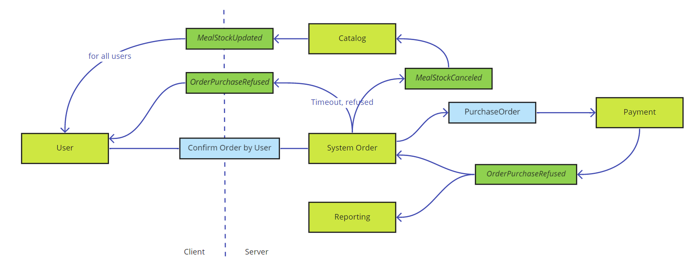

# Information models

Our proposal for the architecture based on event sourcing, messaging and further decoupling of modules from monoliths. Thus, we don't see a value in providing relational based diagram with entities and links between them. Instead we can provide size estimation for main entities and frequency of events. Based on this information we can calculate required storage space and network bandwidth estimation with forecasts for system growth.  

The following cases represent the most important parts for an early stage of application.  

## General considerations

One of the biggest advantages for the whole data management process is geo separation. Almost everything might be shared based on geo-locations of users and fridges. Every big enough geo district (city district, city, suburban area) will have its own shared data that doesn't require any replication anywhere. Ghost kitchens in Detroit won't offer meals in New-York City. Users travel all the time, but their past orders do not. In each new area there would be a unique set of preferences according to the presented ghost kitchens. Only fairly small amount of data needs to be accessed in any location, like payment information. This basic idea and assumption simplify the overall data model in terms of access, replication, modifying and so on.   

## Cases

### Client application

Here under client application we understand mobile application and point of sale app, as they behave on conceptual level identically and require the same events and data.

_Why is it important?_

The application is the main communication channel and the process of catalog browsing and purchasing should be fast and reliable from the user's perspective. Access to past data related to a user should be smooth as well.

Slow working application discourage users from using it and do any purchases as they fear that payment information might be lost, order double charged and so on.

#### Stakeholders concerns

| Stakeholder | Concerns |
|---------|------|
| Subscriber | Get information about upcoming order according to a schedule |
| | Ability to modify (change\cancel) scheduled menu |
| Known users | Browse catalog with no delay and check availability of meals in fridges for a selected area |
| | Purchase and reserve meal |
|  | Executing purchase with minimum clicks in interface |
| Occasional users | Get information about nutrition facts for selected meal |
| | Buy selected meal without significant delay waiting data about meal availability\reservation |
| Pos Admins | Executing purchase with minimum clicks in interface |
| Developers | Data models simplicity |

#### Diagrams

**Meal stock updates**

The main accent here is how data on client's devices will be updated and information about available meals can be kept up to date. Based on the diagram and the business model updates might be sent to users based on their location. Location might update every time when the user opens the application.

In the image above you can see the order of events/commands. It represents how a client app get updates about offered meals and the amount of meals in stock.

| Event\Command\Queries | Description | Frequency | Size (kb)  |
|-------|-----|--------|---|
| Catalog Updated | Notification event to client app that catalog have changes in meals offering. Note, that Smart fridges publish the same event. Even if it's not true from technical point of view, our ACL can transform data from fridges to this event to unify overall processing | Most probably once per day per user | 0,1 |
| Meal Stock Updated | Contains information about a meal and remain amount in stock  | With every placed order. Batch update from Smart Fridges. Delivery might be optimized by the user's location. | 0,1-150 |
| Meal Stock Reserved | Notify the Catalog that meal has been reserved from user. Helps manage amount of meals in stock  | With every placed order | 0,1 |
| Get Catalog (query) | Reference to a specific catalog or all of available catalogs in the user's area | Every time when a user starts forming a new order. 1-2 times per day by schedule | 0,1/150-300 (without images) |
| Confirm Order by User | Command that send user's intention to order a meal | Every time when user confirms order and about to pay| 0,2 |

TRADE-OFFS:
- _CatalogUpdated_ might have information about the update, such as a new meal description, ingredients and so on. It seems to be a nice approach as it is a "push" model and clients get all necessary information without a need to request backend for additional information. On the other hand, not all clients might be reachable and process the data. Also there might be several catalogs and push updates to a client with the entire catalog might not be necessary, as client can have preference for a certain meal catalog. The most reasonable way might be just inform about the fact of update, catalog name/id, location.

**Meal purchase**

Diagram shows a sunny day scenario in a simplified way to represent how order information flows through the system and how user got response about purchase. Coupon checks is omitted, as it's bonus feature =) This case tightly coupled with a previous one about stock change propagation.

| Event\Command\Queries | Description | Frequency | Size (kb)  |
|-------|-----|--------|---|
| Start Order | Self-descriptive :) Just prepare a place holder for a new order. Nothing bother backend. | We don't care as it local command | N/A |
| Apply Coupon | User apply code and we don't care yet what the code is | We don't care as it local command | N/A |
| Confirm Order by User | User confirms that order if formed and it's sign for a local app, that the order should be sent to the backend for processing | Every time when the user finishes order composing and going to pay. 1-3 time per day per user (except subscribers) | 0,2 |
| Purchase Order | Order system checks that the order can be technically delivered (i.e. there are sufficient amount of meals in a fridge) and the payment system should confirm actual purchase |  1-3 time per day per user (except subscribers) | 0,2 |
| Order Purchase Confirmed | Self-explained | Once per order normally | 0,1 |
| Meal Stock Updated | Catalog informed that the amount of meals changed. | With every confirmed order, and update from SmartFridges | 0,2 |
| Order purchased | Confirmation for user and the client app that everything processed successfully and fridge, or ghost kitchen informed about user's desire | Once per order normally. | 0,1 |

**Cancel order by user**

The story behind this diagram is that user can cancel any order, and as gmail do, we can inhibit order execution for a 10-30 seconds to give a chance for a user to cancel an order without any complications as refunding and involving payment systems. In common case, user get's notification about order processing as soon as backend get the command for making order. But then it's totally ok, to postpone any further actions for a some time as a purchase might be impulsive and immediate cancelation could happen.  

The case when the payment system charged a user and there is a cancelation happened described in the next section.

| Event\Command\Queries | Description | Frequency | Size (kb)  |
|-------|-----|--------|---|
| Start Order | Self-descriptive :) Just prepare a place holder for a new order. Nothing bothers the backend. | We don't care as it local command | N/A |
| Cancel order by user | We must take care about two major cases: 1) cancel order that wasn't confirmed yet. Then no impact on backend. 2) Request was sent, but then canceled. | 2%-5% of all orders | 0,1 |
| Meal Stock Canceled | - | 2%-5% of all orders | 0,1 |
| Meal Stock Updated | Catalog informed that the amount of meals changed. | With every confirmed order, and update from SmartFridges | 0,2 |

**Cancel scheduled order by user**

It's a normal situation when a user prepaid for some service and then can cancel it at any time. So we should represent it in our system as well, because "subscribers" is the target group for Farmacy Food. So a _subscriber_ should

Important thing here is that in case of cancelling scheduled orders, there is no impact on meals catalog, as user in general should cancel something that does not exist. Refund process mainly is a technical concern, but there might be business aspects. So having _ClaimRefund_ command is nice, as we can process it in different ways based on business model.

ASSUMPTIONS:
- User can't cancel meals that were already produced and delivered. Cancelation is effective from the next business day. But it's a business decision. Meals can be moved to an available-to-all-stock.  

RISKS:
- Ghost kitchen prepare meals up to 3 days upfront according to a schedule. Probability is low, as FF strives for fresh and healthy food and (we hope) minimal wastes.

#### Lifetime concerns

We assume that following entities will be presented and stored on user's device.

- **The meal Catalog** lives around 24 hours or less on a user's device and then should be forced to update.
- **History of orders** on local devices might live around month to provide ability of fast reordering. Scheduled orders should have the same life span.
- **Notifications** about meal ordering lives around 24 hours.
- **Promo notifications** available during the whole campaign or manual deleting.  

### Order processing on backend

_Why is it important?_

Order processing (single purchases or scheduler orders) is a money maker part of the system. We'd like to review related parts and identify main moving parts, quarantine, sensitive points and other possible concerns.

A clear model of how it works helps to ease the implementation process and address risks (business and technical) earlier during system design.  

#### Stakeholders concerns

| Stakeholder | Concerns |
|---------|------|
| All type of users | Accurate processing with a time fashioned feedback about purchase result |
| Ghost kitchen | Information about upcoming orders |
| Owner | Analytics about usage patterns |

#### Diagrams

Many aspects was touched on previous diagrams and at this stage of development we can reference to them without changes.

**Cancel scheduled order by payment system**

The most interesting part here are events from the _System order_. The payment might be refused, or take so much time that it should be refused by timeout. In both cases user should be notified about a failure.

The most important part here is to notify the user that purchase failed. Then the backend should not store any operational information about the purchase, only the reporting domain will know about the failed attempt. User's app can handle _OrderPurchaseRefused_ as a signal to retry the last order from the order history that is stored locally. User just need to confirm a new attempt.

SENSITIVE POINTS:
- Business should decide about the time when an order can be canceled and what to do with the funds.
- If a meal was produced but a user didn't grab it - can it be released to a common catalog as an available meal?

**Preparing scheduled orders for subscribers**

We want to introduce a scheduled order that represents user intention about future orders that are already prepaid. Responsibility of _Scheduler_ to find those orders and provide a "report" to Ghost Kitchen about required meals to prepare and dispatch. Informing users about meals for preparation and dispatching to fridges support the business goal of user engagement and satisfaction. Informed user - happy user.

| Event\Command\Queries | Description | Frequency | Size (kb)  |
|-------|-----|--------|---|
| Get Scheduled Orders | | once per day typically to provide refill info for kitchen or on demand | 2-5 |
| Prepare Orders | | once per day typically to provide refill info for kitchen or on demand | 20-50 |
| OrderDispatched | | 0-2 times per day typically per fridge. Comes from the domain specifics. Delivery won't happen multiple times per day by request. | 10-30 |
| OrderPlacedInFridge | |  0-2 times per day typically per fridge. Comes from the domain specifics. Delivery won't happen multiple times per day by request. | 10-30 |
| OrderAvailableForPicking | | 0-3 times per day typically per user | 0,1 |

ASSUMPTIONS:
- Fridges can report about stock refill.
- Meals have unique ids that allows associate a meal to a user. It's necessary for customized meals (for instance, lactose free lasagna)
- Ghost kitchen can report about prepared meals.

TRADE-OFFS:
- Scheduled orders might be decomposed and created up front for the whole period of scheduling. Then it will bloat the order base and requires a special mark that can tell us when an order should be executed. It might be simpler in terms of order processing, as all necessary orders are in place. But it brings issues when the schedule changes or cancels. Multiple updates are required. On the other side, schedule might be a logical structure, according to which every day new orders will be generated and processed. It will be much easier to handle changes in schedule, but introduce additional rules for the payment processing part. Such orders should be marked as pre-paid. Might be solved with a special promo campaign "subscriber".

#### Lifetime concerns

All events end up in StoreEvent and will be kept indefinitely, or based on retention policy that might be 1-2 years. But the whole idea of event sourcing is about to keep events forever for further analysis that might be not required at the time of data collection.

### Promotional campaigns

_Why is it important?_

The one of business goals is to expand to other areas and convert occasional users to subscribers. Promotional campaigns used wisely is a great leverage for user base growth and engages users to use applications again and again.

#### Stakeholders concerns

| Stakeholder | Concerns |
|---------|------|
| All type of users | Ability to use campaign promotional materials |
| Subscribers, Known Users | Information about bonus points and ability to use them |
| Owner | Source for analytics about involvement, usage, bonus point spendings |
| | Popularity of provided meals |
| Admins of promo | Ease of creating and tracking campaigns |

#### Diagrams

TBD

#### Lifetime concerns

All campaigns kept in the system for at least 1-2 years to review how it worked for seasonal promotions (as example).

Appliance based on campaign time frames.

### Amount of meals sold

_Why is it important?_

Blazingly fast application and brilliant promotional campaigns won't help if there is no information about in-stock meals so users could actually benefit from the app and promo. We should strive to provide as actual info about available meals in-stock as possible.  

Ghost kitchen (3rd party as well) could gain information about actually sold and picked up items (the first does not always implies the second). It might help them better plan a production plan for the next day or two.  

#### Stakeholders concerns

| Stakeholder | Concerns |
|---------|------|
| All type of users | Actual information about available meals to avoid disappointment when after some purchasing steps in the app there is notification about out-of-stock. |
| Owner | Increase the level of satisfaction for users |
| Ghost kitchen | Information about actually sold and dispatched items  |
| Developers | Avoid race conditions and unnecessary complexity in data updating |  

#### Diagrams

**Meal purchase**

(this is the copy one of previous scenarios)

The diagram represented a sunny day scenario in a simplified way to represent how order information flows through the system and how user got response about purchase. Coupon checks is omitted, as it's bonus feature =) This case tightly coupled with a previous one about stock change propagation.

| Event\Command\Queries | Description | Frequency | Size (kb)  |
|-------|-----|--------|---|
| Start Order | Self-descriptive :) Just prepare a place holder for a new order. Nothing bothers the backend. | We don't care as it local command | N/A |
| Apply Coupon | User apply code and we don't care yet what the code is | We don't care as it local command | N/A |
| Confirm Order by User | User confirms that order if formed and it's sign for a local app, that the order should be sent to the backend for processing | Every time when the user finishes order composing and going to pay. 1-3 time per day per user (except subscribers) | 0,2 |
| Purchase Order | Order system checks that the order can be technically delivered (i.e. there are sufficient amount of meals in a fridge) and the payment system should confirm actual purchase |  1-3 time per day per user (except subscribers) | 0,2 |
| Order Purchase Confirmed | Self-explained | Once per order normally | 0,1 |
| Meal Stock Updated | Catalog informed that the amount of meals changed. | With every confirmed order, and update from SmartFridges | 0,2 |
| Order purchased | Confirmation for user and the client app that everything processed successfully and fridge, or ghost kitchen informed about user's desire | Once per order normally. | 0,1 |

## Estimations of usage and costs

_add link here to the page or file_

## Backup concerns

- We don't need to backup data for orders in MQ, as the client app should implement a timeout mechanism for sending requests and getting responses. If there is no confirmation about payment acceptance or rejection, a user should be notified and retry should be offered. So for MQ we can rely on the build-in persistence model for the service restart scenario.
- EventStore requires a backup mechanism as it is vital information for the system. Projections generated by EventStore do not require backup as they can be reconstructed from events in EventStore. But we can backup projections to speed up the recovery scenario.
- Report service requires backup mechanism to keep operational and historical data for analysis
- Kafka does not require additional backup mechanisms on this stage and we can rely on built-in mechanisms.
