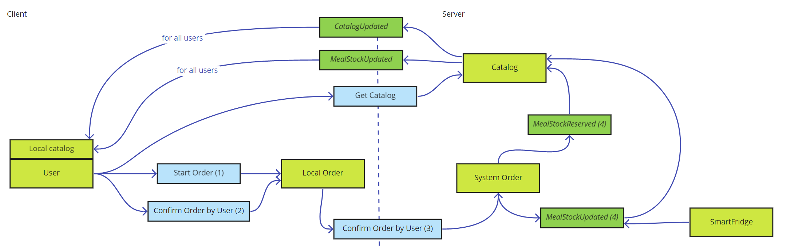
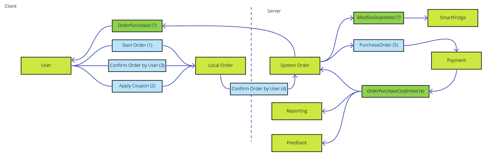

# Information models 

Our proposal for the architecture based on event sourcing, messaging and further decoupling of modules from monoliths. Thus, we don't see a value to provide relational based diagram with entities and links between them. Instead we can provide size estimation for main entities and frequency of events. Based on this information we can calculate required storage space and network bandwith estimation with forecasts for system growth.  

The following cases represents the most important parts for a early stage of application.  

## General considerations 

One of the biggest advantages for the whole data management process is geo separation. Almost everything might be sharder based on geo-locations of users and fridges. Every big enough geo district (city district, city, suburbane area) will have it's own shard of data that don't require any replication anywhere. Ghost kitchen in Detroit won't offer meals in the New-York City. User's traveling all the time, but their past orders not. In each new area there would be the unique set of preferences according to a presented ghost kitchens. Only a fairly small amount of data need to be accessed in any location, like payment information. This basic idea and assumption simplify overall data model in terms of access, replication, modifying and so on.   

## Cases 

### Client application 

Here under client application we understand mobile application and point of sale app, as they behave on conceptual level identically and require the same events and data. 

_Why is it important?_ 

The application is the main communication channel and the process of catalog browsing and purchasing should be fast and reliable from user's perspective. Access to past data related to a user should be smooth as well. 

Slow working application disenurage users from using it and do any purchases as there fear that payment information might be lost, order double charged and so on. 

#### Stakeholders concerns 

| Stakeholder | Conserns | 
|---------|------| 
| Subscriber | Get information about upcoming order according to a schedule | 
| | Ability to modify (change\cancel) scheduled menu |
| Known users | Browse catalog with no delay and see meals availability in fridges for selected area | 
| | Purchase and reserve meal | 
|  | Executing purchase with minimum clicks in interface |
| Ocassional users | Get information about nutrition facts for selected meal | 
| | Buy selected meal without significant delay waiting data about meal availability\reservation | 
| Pos Admins | Executing purchase with minimum clicks in interface | 
| Developers | Data models simplicity | 

#### Diagrams 

**Meal stock updates** 

On the image above you can see order of events/commands. It represents how a client app get updates about offered meals and amount of meals in stock. 

| Event\Command\Queries | Description | Frequency | Size (kb)  | 
|-------|-----|--------|---|
| Catalog Updated | Event that notify client app that catalog have changes in meals offering. | Most probably once per day per user | 0,1 | 
| Meal Stock Updated | Contains information about a meal and remain amount in stock  | With every placed order. Batch update from Smart Fridges. Delivery might be optimized by user's location. | 0,1-150 |
| Meal Stock Reserved | Let know the Catalog that meal soon will be reserved. Helps manage amount of meals in stock  | With every placed order | 0,1 |
| Get Catalog (query) | Reference to a specific catalog or all of available catalogs in the user's area | Every time when user starts forming new order. 1-2 times per day by schedule | 0,1/150-300 (without images) | 
| Confirm Order by User | Command that send user's intention to order a meal | Every time when user finish order composing and going to pay | 0,2 | 

**Meal purchase** 

| Event\Command\Queries | Description | Frequency | Size (kb)  | 
|-------|-----|--------|---|
| Start Order | Self-descriptive :) Just preapre a place holder for a new order. Nothing bother backend. | We don't care as it local command | N/A | 
| Apply Coupon | User apply code and we don't care yet what the code is | We don't care as it local command | N/A | 
| Confirm Order by User | User confirms that order if formed and it's sign for a local app, that the order should be sent to the backend for processing | Every time when user finish order composing and going to pay. 1-3 time per day per user (except subscribers) | 0,2 | 
| Purchase Order | Order system checks that the order can be technicaly delivered (i.e. there are sufficient amount of meals in a fridge) and the payment system should confirm actual purchase |  1-3 time per day per user (except subscribers) | 0,2 | 
| Order Purchase Confirmed | Self-explained | Once per order normally | 0,1 | 

TRADE-OFFS:
- _CatalogUpdated_ might have information about the update, such as a new meal description, ingridients and so on. It seems to be a nice aproach as it "push" model and clients get all necessary information without a need to callback backend for an additional information. From other hand, not all clients might be reachable and process the data. Also there are might be several catalogs and push updates to a client with entire catalog might be not necessary, as client can have preference for a certain meal catalog. The most reasonable way might be just inform about the fact of update, catalog name/id, location. 

#### Lifetime concerns 

We asume that following entities will be presented and stored on user's device. 

- **The meal Catalog** lives around 24 hours or less on user's device and then should be forced to update.
- **History of orders** on local device might live around month to provide ability of fast reordering. Scheduled orders should have the same life span. 
- **Notifications** about meal ordering lives around 24 hours.
- **Promo notifications** available during whole compaign or manual deleting.  

### Order processing on backend 

_Why is it important?_ 

Order processing (single purchases or scheduler orders) is a money maker part of the system. We'd like to review related parts and identify main moving parts, quaranties, sensitive points and other possible concerns. 

A clear model how it works helps to ease implementation process and address risks (business and techincal) earlier during system design.  

#### Stakeholders concerns 

| Stakeholder | Conserns | 
|---------|------| 
| All type of users | Accurate processing with a time fashioned feedback about purchase result | 
| Ghost kitchen | Information about upcoming orders | 
| Owner | Analytics about usage patterns | 

#### Diagrams 

#### Lifetime concerns 

### Promotional compaigns 

_Why is it important?_

The one of business goals is to expand to other areas and convert ocassional users to subscribers. Promotional compaigns used wisely is a great leverage for user base growth and engage users to use application again and again. 

#### Stakeholders concerns 

| Stakeholder | Conserns | 
|---------|------| 
| All type of users | Ability to use compaign promotional materials | 
| Subscribers, Known Users | Information about bonus points and ability to use them | 
| Owner | Source for analytics about involvment, usage, bonus point spendings | 
| | Popularity of provided meals | 
| Admins of promo | Ease of creating and tracking compaigns | 

#### Diagrams 

#### Lifetime concerns 

### Amount of meals sold

_Why is it important?_

Blazingly fast application and brilliant promotional compaigns won't help if there is no information about in-stock meals so users could actually benefit from the app and promo. We should strive for providing as actual info about available meals in-stock as possible.  

Ghost kitchen (3rd party as well) could gain information about actually sold and picked up items (the first do not always implies the second). It might help them better plan production plan for the next day or two.  

#### Stakeholders concerns 

| Stakeholder | Conserns | 
|---------|------| 
| All type of users | Actual information about available meals to avoid disappointment when after some purchasing steps in the app there is notification about out-of-stock. |
| Owner | Increase the level of satisfaction for users | 
| Ghost kitchen | Information about actually sold and dispatched items  | 
| Developers | Avoid race conditions and unnecessary complexity in data updating |  

#### Diagrams 

#### Lifetime concerns 

## Estimations of usage and costs

## Backup concerns 

- We don't need to backup data for orders in MQ, as the client app should implement a timeout mechanism for sending requests and getting responses. If there is no confirmation about payment acceptance or rejection, a user should be notified and retry should be offered. So for MQ we can rely on the build-in persistence model for the service restart scenario.
- EventStore requires a backup mechanism as it vital information for the system. Projections generated by EventStore do not require backup as they can be reconstructed from events in EventStore. But we can backup projections to speedup the recovery scenario.
- Report service requires backup mechanism to keep operational and historical data for analysis
- Kafka do not require additional backup mechanism on this stage and we can rely on a build-in mechanisms.

