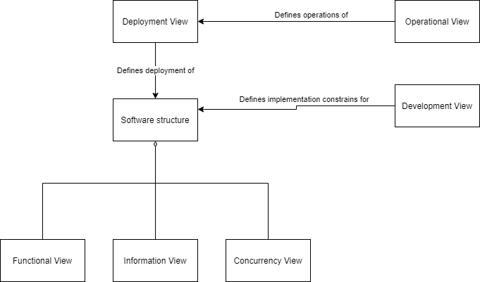

Figure 1: View Relationships [1](#references)

1. [User Scenarios](./UserScenariosPerspective.md)
1. [Information View](./InformationModels.md) - Describes the way that the architecture stores, manipulates, manages, and distributes information
1. [Concurrency View](./Concurrency.md) - Describes the concurrency structure of the system and maps functional elements to concurrency units to clearly identify the parts of the system that can execute concurrently and how this is coordinated and controlled.
1. [Deployment View](./DeploymentView.md) - Describes the environment into which the system will be deployed, including the dependencies the system has on its runtime environment
1. [Security View](./Security.md) - The security perspective guides you as you consider the set of processes and technologies that allow the owners of resources in the system to reliably control who can perform what actions on particular resources.
6. [Cost Analysis](./CostAnalysis.md) - Estimation of expenses for AWS cloud services.

## References
[1] Reproduction of Figure 15-1 View Relationships as found in _Software Systems Architecture: Working with Stakeholder Using Viewpoints and Perspectives, Nick Rozanski, Eoin Woods, ISBN: 0321112296_
