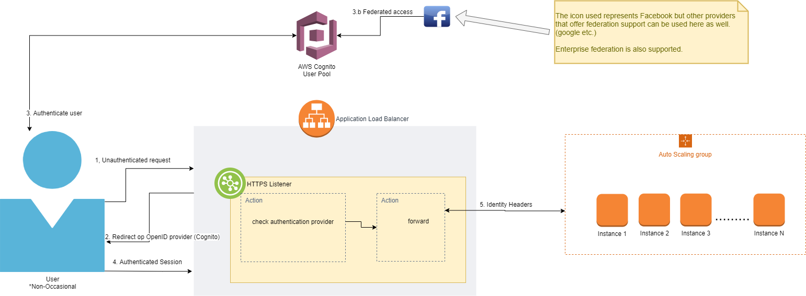

# Security perspective

The security perspective guides you as you consider the set of processes and technologies that allow the owners of resources in the system to reliably control who can perform what actions on particular resources.

The ability of the system to reliably control, monitor, and audit who can perform what actions on these resources and the ability to detect and recover from failures in security mechanisms

## Authentication and Authorization

### Authentication

Figure 1: High-level overview of the authentication flow

Figure 1 shows the general flow of authentication for customer/client access over the internet. This flow is **not** used for direct communication to AWS resources.

### Cognito
AWS offers a service called Cognito which we use here to handle our authentication needs. The flow described here is known as the [Authorization Code Grant](https://aws.amazon.com/blogs/mobile/understanding-amazon-cognito-user-pool-oauth-2-0-grants/).

> Some clients don't support redirect handling (302 handling) natively or by default. This is a common cause of error/misunderstandings in development.

Cognito has all the necessary forms built-in to use in your login, logout, profile, etc. screens. Styling can be applied to brand all screens.

#### Settings
- Make sure to use the User Pool setting in Cognito!
- Allow _with username_ for login
- Allow _verified e-mail address_ for login
- Add attributes to the identity data: phone number, email.
- Allow _openid_ scope
- Set the load balancer's _scheme_ to _internet facing_

### Federation

Federation allows for other authentication providers to be hooked up to our systems. A practical example of this is giving the user the option to log in to *your system* using their google, Facebook, or other social media site login. The use of federation will immediately generate trust in your system with a large portion of potential users.

> Support non-federated authentication too. Some people may either trust *your* site less than the federated authentication provider's (ie. Google). This may make them skeptical. To further support the availability of your own authentication provider, you should consider that users may want to use different passwords for different online services from a security perspective. 

### Loadbalancer
The design offered here uses the load balancer directly to provide authentication. The HTTPS Listener is used with a set of rules that provide actions for checking the identity of the user requesting the resource. Once this is done we use the load balancers' rule to forward the traffic to the appropriate scaling group. [Infrastructure Scaling and Balancing](./InfrastructureScalingAndBalancing.md))

### Pricing

Though the pricing of Cognito can be found on the pricing list on the AWS website, we would like to clarify one thing. The pricing of Cognito is based on unique users per month. Billing **does not** go up if a user logs in multiple times per month nor when they perform multiple requests. If a user doesn't log in or register during a month you will not be billed for that user. Please check [AWS Cognito pricing](https://aws.amazon.com/cognito/pricing/) for up-to-date information.

## Applicability to Views  
|  View | Aspects of applicability |
|------|---------|
| Functional | Reveals which functional elements need to be protected. Functional structure may be impacted by the need to implement your security policies. |
| Information | Reveals what data needs to be protected. Information models are often modified as a result of security design (e.g., partitioning information by sensitivity). |
| Concurrency | Security design may indicate the need to isolate different pieces of the system into different runtime elements, so affecting the system’s concurrency structure. |
| Development | Captures security related development guidelines and constraints. |
| Deployment | May need major changes to accommodate security-oriented hardware or software, or to address security risks. |
| Operational | Needs to make the security assumptions and responsibilities clear, so that these aspects of the security implementation can be reflected in operational processes. |

## Risks

## Checklist for Architecture Definition and further work
- Have you addressed each threat identified in the threat model to the extent required?
- Have you used as much third-party security technology as possible?
- Have you produced an integrated overall design for the security solution?
- Have you considered all standard security principles when designing the infrastructure?
- Is your security infrastructure as simple as possible?
- Have you defined how to identify and recover from security breaches?
- Have you applied the results of the Security perspective to all the affected views?
- Have external experts reviewed your security design?
